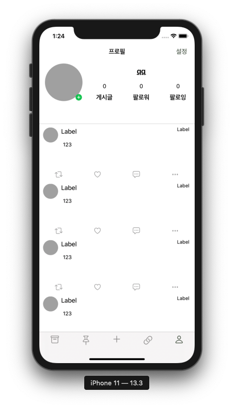
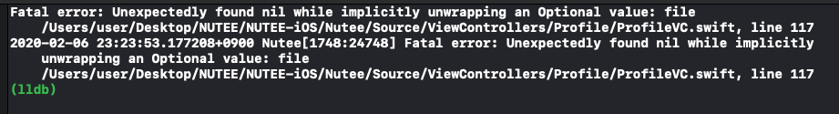
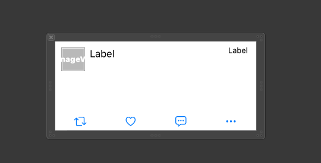
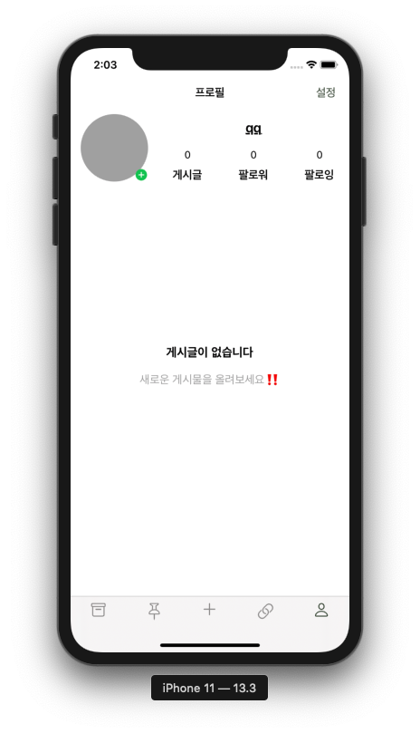
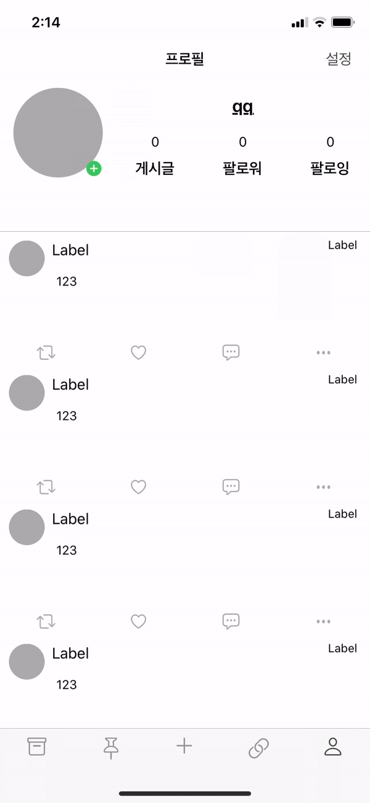

# 네번째 스터디

## 테이블 뷰 다루기

----

이번 시간에는 학교 프로젝트를 진행하며 배운 테이블 뷰 다루는 방법에 대해서 알아보겠습니다.

이번 프로젝트를 진행하게 될때 이런 뷰를 그리기를 원했습니다. // 위로 스크롤을 할 때 같이 프로필 부분이 같이 내려가는 것

이 뷰를 구현하게 될 때 위쪽 프로필 구성 뷰에서 스크롤뷰를 사용하지 않고 테이블뷰 하나만으로 구성할수있는 방법에 대해 생각을 해보다 헤더뷰로 구현을 하면 간단하게 해결할수있겠다는 생각을 가지고 구현을 하기 시작했습니다.

테이블 headerView, footerView를 제가 구성할 때 사용한 방법은 코드로 구현을 하였고 아래의 코드와 같이 tableView메소드를 사용해 구현을 하였습니다.

미리 만들어둔 headerView에 들어갈 UIView

~~~swift
    let headerView = UIView()
    let profileImage = UIImageView()
    let setProfile = UIButton()
    let myNickLabel = UIButton()
    let myArticle1Btn = UIButton()
    let myArticle2Btn = UIButton()
    let myFollower1Btn = UIButton()
    let myFollower2Btn = UIButton()
    let myFollowing1Btn = UIButton()
    let myFollowing2Btn = UIButton()
~~~

headerView

~~~ swift
    // MARK : headerView
    func tableView(_ tableView: UITableView, viewForHeaderInSection section: Int) -> UIView? {
        
        self.headerView.addSubview(profileImage)
        self.headerView.addSubview(myNickLabel)
        self.headerView.addSubview(setProfile)
        self.headerView.addSubview(myArticle1Btn)
        self.headerView.addSubview(myArticle2Btn)
        self.headerView.addSubview(myFollower1Btn)
        self.headerView.addSubview(myFollower2Btn)
        self.headerView.addSubview(myFollowing1Btn)
        self.headerView.addSubview(myFollowing2Btn)
        
        let etcname : String = userInfo?.nickname ?? ""
        
        let name = NSMutableAttributedString(string: etcname)
        name.addAttribute(NSAttributedString.Key.underlineStyle, value: NSUnderlineStyle.single.rawValue, range: NSMakeRange(0, etcname.count))
        
        profileImage.backgroundColor = .lightGray
        profileImage.setRounded(radius: 50)
        profileImage.translatesAutoresizingMaskIntoConstraints = false
        profileImage.topAnchor.constraint(equalTo: headerView.topAnchor, constant: 10).isActive = true
        profileImage.leftAnchor.constraint(equalTo: headerView.leftAnchor, constant: 15).isActive = true
        profileImage.heightAnchor.constraint(equalToConstant: 100).isActive = true
        profileImage.widthAnchor.constraint(equalToConstant: 100).isActive = true
        
        setProfile.setImage(.add, for: .normal)
        setProfile.tintColor = .black
        setProfile.translatesAutoresizingMaskIntoConstraints = false
        setProfile.topAnchor.constraint(equalTo: profileImage.bottomAnchor, constant: -20).isActive = true
        setProfile.leftAnchor.constraint(equalTo: profileImage.rightAnchor, constant: -20).isActive = true
        setProfile.heightAnchor.constraint(equalToConstant: 20).isActive = true
        setProfile.widthAnchor.constraint(equalToConstant: 20).isActive = true
        setProfile.setRounded(radius: 10)
        
        // autolayout code 구현 부분
        
        return headerView
    }

~~~

와 같이 코드베이스로 작성을 했으며

~~~swift
    func tableView(_ tableView: UITableView, heightForHeaderInSection section: Int) -> CGFloat {
        return 170
    }

~~~

로 높이를 조정했습니다.

하지만 코드로 구현을 하게 되면 오류가 발생을 했는데

~~~swift
        myArticleTV.delegate = self
        myArticleTV.dataSource = self
        self.myArticleTV.register(ArticleTVC.self, forCellReuseIdentifier: "ArticleTVC")
~~~

생명주기 부분에서 register를 해줘야 오류발생이 일어나지 않았습니다.

이렇게 헤더뷰를 구현하는데 어려움이 조금 있었는데 문제는 main TableView를 구현하는데에 문제가 있었습니다.

평소처럼 TableViewCell.swift 파일을 만들어 구현을 하려 했으나 

와 같은 에러가 발생을 해 여러부분으로 알아봤으나 위의 register를 한 부분이 에러가 발생하는 원인이었습니다.

이런 에러를 해결하는 방안으로 xib파일을 이용해 cell을 만들어 따로 register를 해주면 되었습니다

구현 방법은 1번째 스터디에서 cell xib 파일을 만드는것과 동일하게

~~~swift
override func viewDidLoad() {
	super.viewDidLoad()
        
  myArticleTV.register(UINib(nibName: "ProflieTableViewCell", bundle: nil), forCellReuseIdentifier: "ProflieTableViewCell")
    }
~~~

~~~swift
    func tableView(_ tableView: UITableView, cellForRowAt indexPath: IndexPath) -> UITableViewCell {
        
        let cell = tableView.dequeueReusableCell(withIdentifier: "ProflieTableViewCell", for: indexPath) as! ProflieTableViewCell
    return cell
    }
~~~

와 같이 구현해주게 되면 처음에 원했던 구현 방식과 같이 나오게 됩니다.

plus 1. 테이블뷰에 아무것도 없을 때 

와 같이 나타내주기는 간단하게 extension을 통해 구현해주었습니다. 

구현 방법은 비어있는 UIView를 만들어 대체를 해주면 됩니다. 

~~~swift
    func setEmptyView(title: String, message: String) {
        let emptyView = UIView(frame: CGRect(x: self.center.x, y: self.center.y, width: self.bounds.size.width, height: self.bounds.size.height))
      
      let titleLabel = UILabel()
      let messageLabel = UILabel()
      	
      // autolayout 	
      
      self.backgroundView = emptyView
      self.separatorStyle = .none
    }

~~~

~~~swift
    func tableView(_ tableView: UITableView, numberOfRowsInSection section: Int) -> Int {
        if count가 0일때{
            tableView.setEmptyView(title: "게시글이 없습니다", message: "새로운 게시물을 올려보세요‼️")
        } else {
            tableView.restore()
        }
        return count
    }
~~~

plus 2. 테이블 뷰에서 원하는 cell로 이동하기

이 기능을 통해 테이블 내의 맨 마지막 혹은 첫번째로 이동할 수 있습니다.

~~~swift
        let indexPath = NSIndexPath(row: 1, section: 0)
        myArticleTV.scrollToRow(at: indexPath as IndexPath, at: .top, animated: true)
~~~

저는 이 기능을 이용해 게시글만 나오는 부분으로 이동하게 해주었는데 row 값이 0이 되면 이동을 하지 않아 임시 방편으로 0번째 row를 headerView와 mainView를 나눠주는 border로 만들어주고 1번째 cell로 이동하게 해 주었습니다.