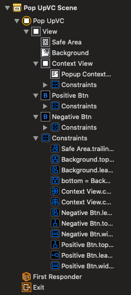
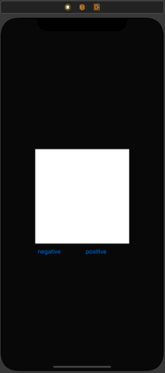
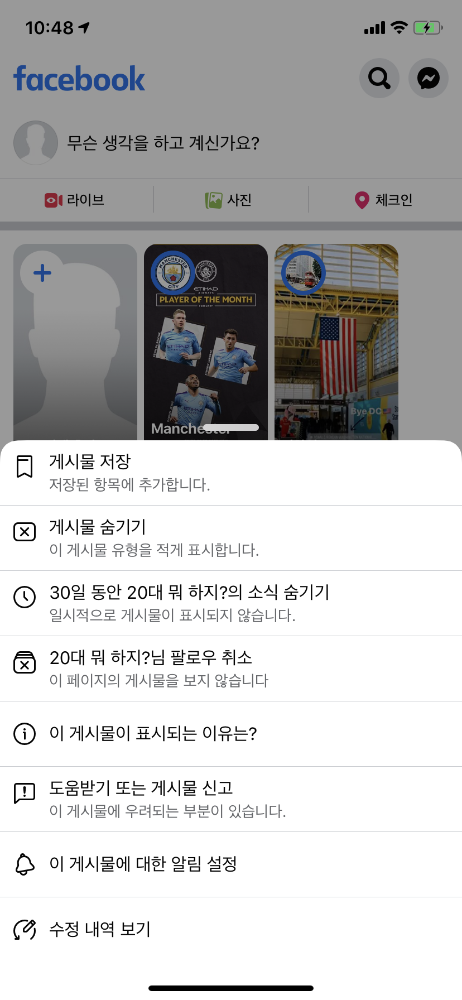
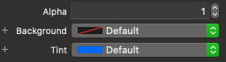
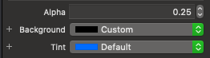
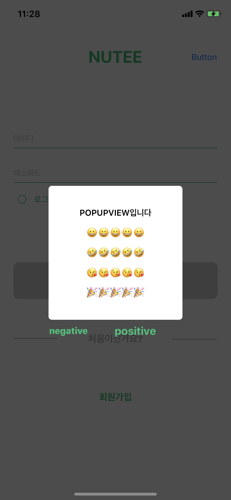

# 네번째 스터디

## PopUpView 만들기

----

이번 시간에는 간단하게 PopUpView를 만들어보겠습니다.

우선 먼저 viewcontroller의 구조를 보여드리면 이렇게 구성이 되어있습니다.

>  

VC를 생성해주신 이후에 자신의 popupView에 나타날 object들을 아래들의 popupview처럼 생성시켜주시면 됩니다.

> 

이번에 간단히 해볼 popupview는 2번째인 view로 해보겠습니다.

처음으로 해야할 일은 superview의 backgroundColor를 default로 변경을 해줘야합니다.

그 이후에 present 된 이후에 뒤 배경과 차이점을 주기 위해 view와 imageView둘 중 하나를 넣어줘 아래와 같이 설정 해주면 됩니다

나머지 설정은 view를 넣어주고 autolayout을 잡아주고 주고싶은 animate를 주게 되면 원하는 뷰를 만들 수 있습니다.

이렇게 뷰를 만들어 준 이후 present할때 하나 중요하게 설정해야하는 부분이 하나 있습니다.

~~~swift
        let sb = UIStoryboard(name: "Util", bundle: nil)
        let vc = sb.instantiateViewController(withIdentifier: "PopUpVC") as! PopUpVC
        vc.modalPresentationStyle = .overCurrentContext
        
        self.present(vc, animated: false)
~~~

바로 modalStyle을 overCurrentContext로 설정해줘야합니다!

이렇게 설정을 해주고 present를 해주게 되면! PopUpView를 만드는 것을 성공했습니다!!

plus 1. 닫기버튼 대신 뒤에 백그라운드를 선택했을때 dismiss시키는 기능

~~~swift
@IBOutlet weak var background: UIImageView!

func backgroundDismiss(){
	background.addGestureRecognizer(UITapGestureRecognizer(target: self, action:Selector(("backgroundTap:"))))
}

@IBAction func backgroundTap(_ sender: UITapGestureRecognizer){
  self.dismiss(animated: false, completion: nil)
}

~~~

