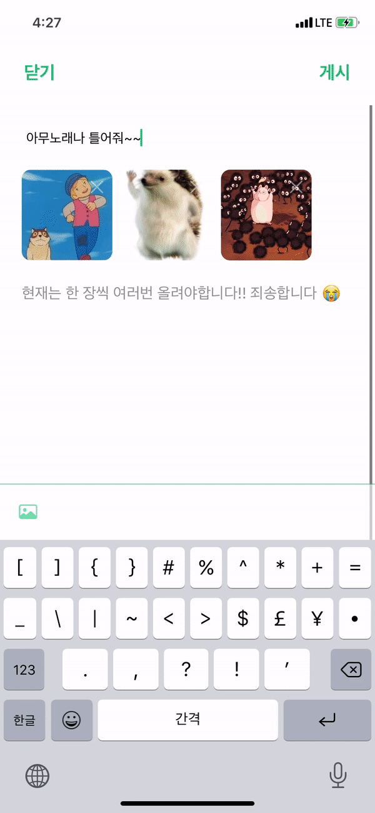

# 일곱번째 스터디

## make custom loading View

---

이번 스터디 시간에는 커스텀 로딩 뷰를 준비 해봤습니다.

동아리 프로젝트를 진행하면서 기존에 있던 캐릭터 이미지를 통해 로딩뷰를 만들면 좋겠다는 생각을 가지고 로딩뷰를 만들어보았습니다.

구현 방법은 [민소네](http://minsone.github.io/mac/ios/easy-make-loading-animation-popup-view-in-swift) 님의 블로그를 보고 클론 코딩 했습니다.

블로그에서 나오는 것처럼 팝업은 언제나 뷰 최상위에 있어야함으로 UIApplication의 첫번째 Scene에 view를 붙여야합니다. 

그리고 싱글톤 디자인 패턴을 사용하는 이유는 생성을 한 이후 위에 생성된 뷰를 지워야함으로 싱글톤 패턴을 사용했습니다.

- 생성한 뷰

~~~swift
	  private static let sharedInstance = LoadingHUD()  

		private var backgroundView: UIView?
    private var popupView: UIImageView?
~~~

- show()

~~~swift
    class func show() {
        let backgroundView = UIView() // 백그라운드 뷰 생성
        
        let popupView = UIImageView() // 이미지 뷰 생성
        popupView.contentMode = .topRight // 사진의 크기, 그리고 위치에 따라서 다르게 설정해주시면 됩니다.
      																		// 자세한 설명은 하단에서~
        popupView.animationImages = LoadingHUD.getAnimationImageArray() // imageView에 이미지 Array를 추가해줍니다.
        popupView.animationDuration = 3 // 로딩이 이 timeInterval 값에 따라서 시간의 값이 달라집니다 원하는 반복 시간을 설정해주세요
        popupView.animationRepeatCount = 0 // 반복 될 횟수를 입력 default는 0이고 default인 경우에는 무한 반복
        
        
        if let window = UIApplication.shared.connectedScenes	// 위 설명에서 작성한것처럼 최상단에 넣기 위한 코드
        .filter({$0.activationState == .foregroundActive})
        .map({$0 as? UIWindowScene})
        .compactMap({$0})
        .first?.windows
        .filter({$0.isKeyWindow}).first {
            window.addSubview(backgroundView)
            window.addSubview(popupView)
            
            backgroundView.frame = CGRect(x: 0, y: 0, width: window.frame.maxX, height: window.frame.maxY)	// 윈도우의 크기에 맞춰 설정
            backgroundView.backgroundColor = UIColor(red: 0, green: 0, blue: 0, alpha: 0.2) // 백그라운드를 투명하게 처리하기 위한 설정
            
            popupView.frame = CGRect(x: 0, y: 0,width: window.frame.maxX, height: window.frame.maxY)	// 이미지의 위치와 크기에 따라 원하는데로 설정해주시면 됩니다.
            popupView.startAnimating() 
                        
            sharedInstance.backgroundView?.removeFromSuperview()
            sharedInstance.popupView?.removeFromSuperview()
            sharedInstance.backgroundView = backgroundView
            sharedInstance.popupView = popupView
        }
    }
~~~

- hide()

~~~swift
    class func hide() {
        if let popupView = sharedInstance.popupView, // 설정해준 팝업뷰와 백그라운드 뷰
        let backgroundView = sharedInstance.backgroundView {
            popupView.stopAnimating()								  
            backgroundView.removeFromSuperview()
            popupView.removeFromSuperview()
        }
    }
~~~

- image Array

~~~swift
    public class func getAnimationImageArray() -> [UIImage] {
        var animationArray: [UIImage] = []
        animationArray.append(UIImage(named: "nuteeLoading_00")!)
        animationArray.append(UIImage(named: "nuteeLoading_01")!)
																		.
      															.
      															.
      											// 원하는 이미지를 원하는만큼 추가

        return animationArray
    }

~~~

## 결과물

> ## Plus.  imageView.contentMode 
>
> 위에서 원하는 위치 혹은 크기에 따라서 설정을 해주면 된다고 설명을 했었는데 
>
> 아래와 같이 이미지 뷰 콘텐츠 모드에 따라서 설정이 변경됩니다. 
>
> [`case scaleToFill`](apple-reference-documentation://hsOg6lLrS1)
>
> The option to scale the content to fit the size of itself by changing the aspect ratio of the content if necessary.
>
> [`case scaleAspectFit`](apple-reference-documentation://hs9DhcAmiy)
>
> The option to scale the content to fit the size of the view by maintaining the aspect ratio. Any remaining area of the view’s bounds is transparent. 
>
> [`case scaleAspectFill`](apple-reference-documentation://hsJdulzq3U)
>
> The option to scale the content to fill the size of the view. Some portion of the content may be clipped to fill the view’s bounds.
>
> [`case redraw`](apple-reference-documentation://hs4ueQvfaD)
>
> The option to redisplay the view when the bounds change by invoking the [`setNeedsDisplay()`](apple-reference-documentation://hs015ZQxaA) method.
>
> [`case center`](apple-reference-documentation://hsGlsK7Qfv)
>
> The option to center the content in the view’s bounds, keeping the proportions the same.
>
> [`case top`](apple-reference-documentation://hsgP21UR1K)
>
> The option to center the content aligned at the top in the view’s bounds.
>
> [`case bottom`](apple-reference-documentation://hsUEcGx6Vp)
>
> The option to center the content aligned at the bottom in the view’s bounds.
>
> [`case left`](apple-reference-documentation://hs_SlDt3ZW)
>
> The option to align the content on the left of the view.
>
> [`case right`](apple-reference-documentation://hsPGS_4SNO)
>
> The option to align the content on the right of the view.
>
> [`case topLeft`](apple-reference-documentation://hs__E2gsQy)
>
> The option to align the content in the top-left corner of the view.
>
> [`case topRight`](apple-reference-documentation://hshObXKiXG)
>
> The option to align the content in the top-right corner of the view.
>
> [`case bottomLeft`](apple-reference-documentation://hs7LEjkcrm)
>
> The option to align the content in the bottom-left corner of the view.
>
> [`case bottomRight`](apple-reference-documentation://hsgZy_L9JO)
>
> The option to align the content in the bottom-right corner of the view.

