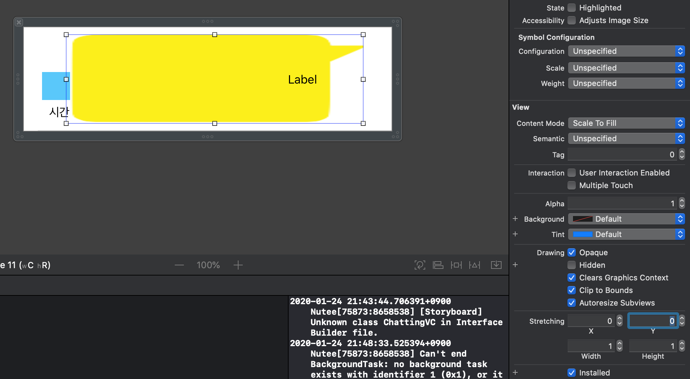
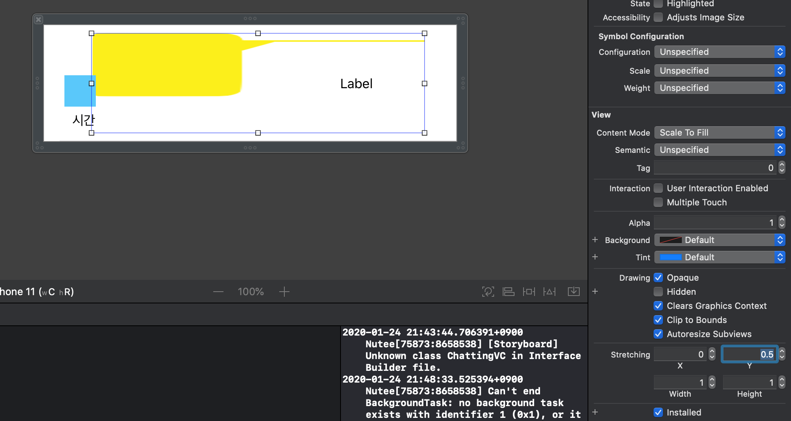
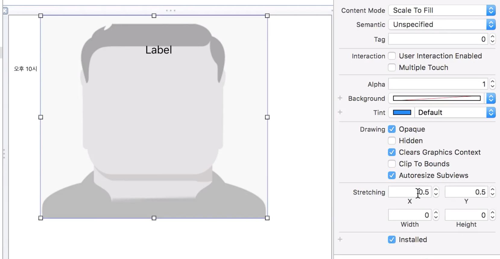
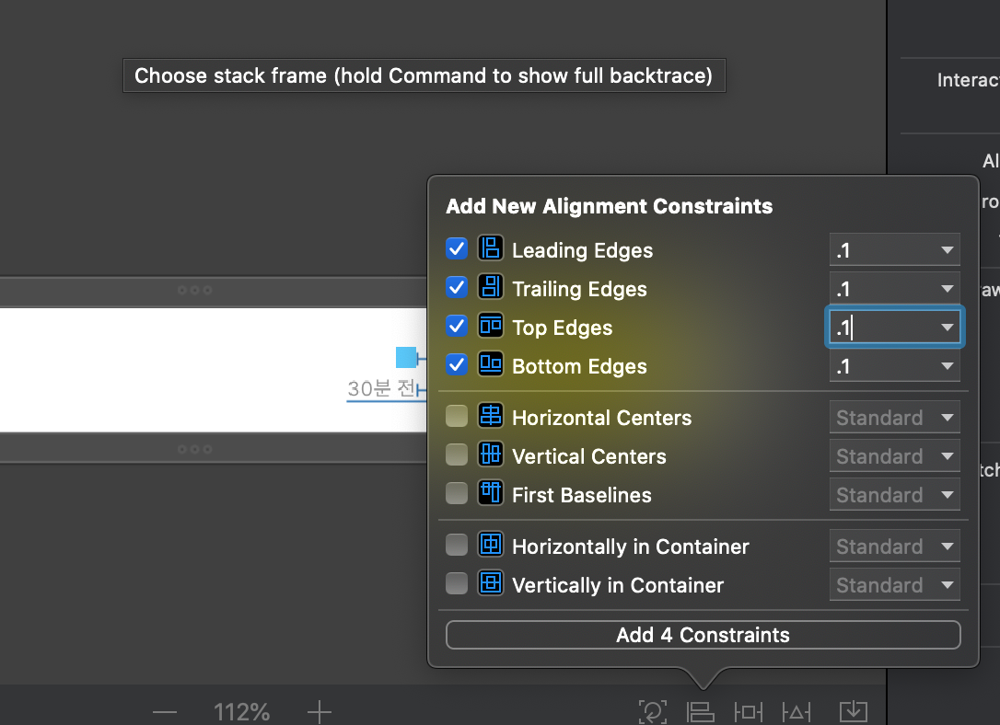
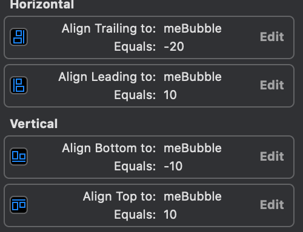
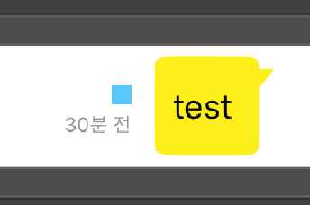
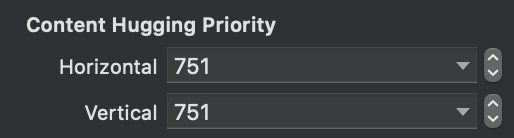

# 첫번째 스터디

## xib를 활용한 채팅 말풍선을 만들기

1. Stretching
UIImage를 사용하면서 사용할 수 있는 기능 중에 하나인 Stretching에 대한 소개입니다.
inspector area에서 조절을 할 수 있고, 기본적인 값은 0, 0으로 되어있습니다. 
또한 기본 이미지 크기보다 커야 적용되는 기능입니다.
x : 0. y : 0의 의미는 시작점 (왼쪽 상단)을 의미 합니다. 각각 시작점으로부터 1까지 설정 할 수 있으며 100%로 환산해 그 부분부터 늘어나게 되는 기능입니다. 
width와 height도 0부터 1까지 설정이 가능하며 100%로 환산해 시작점으로부터 해당하는 %이상인 부분부터 늘어납니다.
- 
0, 0
- 
0.5, 0.5
- 
0.5, 0.5
- 
1, 1

위의 기능을 유용하게 사용해 채팅 말풍선의 크기를 조절해 사용했습니다.

2. Label과 이미지 정렬

우선 label과 UIImage의 정렬이 맞지 않아 동일한 선상에 있지 않을 것입니다.
label과 이미지를 동시에 선택한 이후
- 
위의 사진과 동일하게 설정을 해줍니다. 설정을 해주면 이미지와 label이 맞춰질 것입니다.
- 
이후 위와 같이 설정을 해주시면 이미지 안에 알맞는 크기로 설정되는 label을 볼수있습니다.
- 
또한 각각 cell의 간격을 맞춰주기 위해서 image의 autolayout을 걸어주시면 됩니다.

이후 라벨의 크기에 맞춰서 크기가 줄고 늘어날 수 있도록 label의 content hugging priority를 아래와 같이 늘려주시면 됩니다. 
- 

