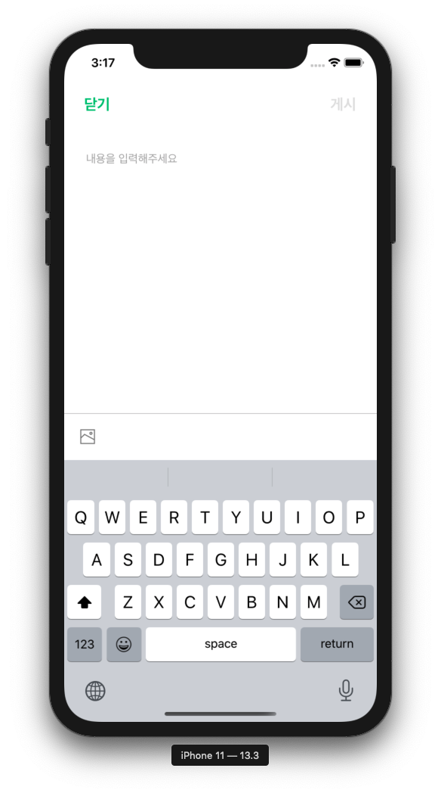
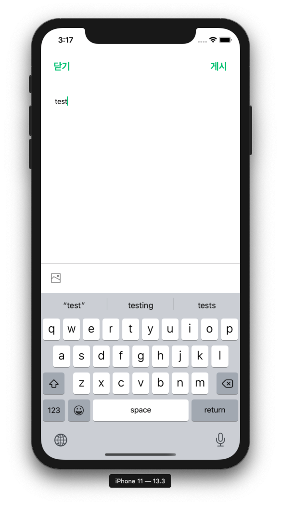
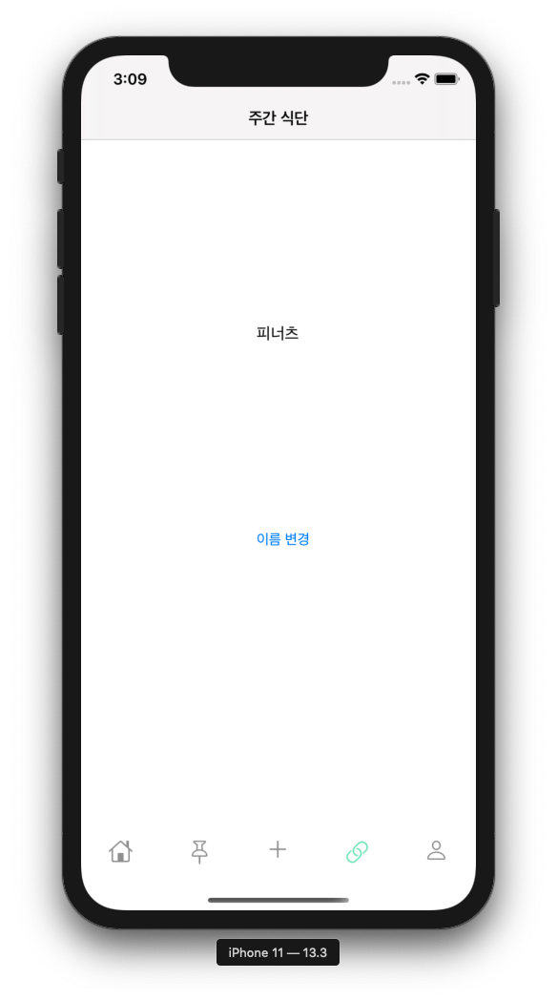
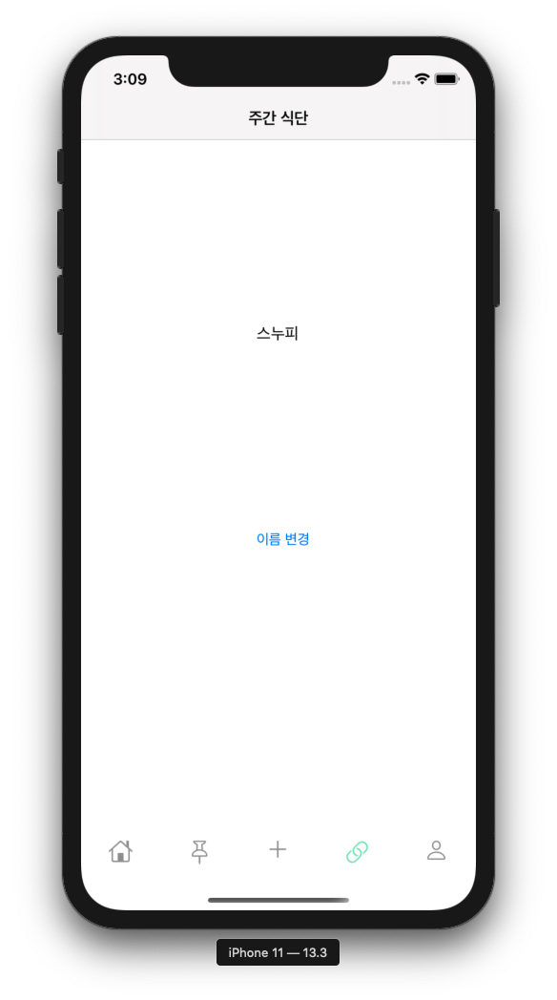

# 두번째 스터디

## NotificationCenter를 활용해 실시간으로 반응하기

> iOS 환경에서는 observer 패턴으로서 사용이 되고 있는 NotificationCenter를 사용해 
> 아래의 코드를 통해
~~~swift
NotificationCenter.default.addObserver(forName: UITextView.textDidChangeNotification, object: postingTextView, queue: OperationQueue.main) { (notification) in
    if self.postingTextView.text != ""{
        self.postBtn.isEnabled = true
    } else {
        self.postBtn.isEnabled = false
    }
}
~~~
> 
> 

> 게시글과 이미지가 작성되었을때 게시 버튼이 활성화 될수있는 기능을 추가할 수 있습니다. 

> 추가적으로 observer 패턴을 사용해 추가할수 있는 기능과 사용법을 알아보자면
> observer 패턴은 해당되는 프로퍼티가 변경 되고 있는걸 관찰하다 변경이 되는 시점에 업데이트가 되도록 하는 패턴입니다.

> observer 패턴으로 이용되는 notification을 사용하는 방법은 
>
> 1. addObserver 메서드를 통해 notificationCenter에 새롭게 생성
>  - [addObserver(forName:object:queue:using:)](https://developer.apple.com/documentation/foundation/notificationcenter/1411723-addobserver)
>  - [addObserver(_:selector:name:object:)](https://developer.apple.com/documentation/foundation/notificationcenter/1415360-addobserver)
>
> 2. post 메서드를 통해 해당하는 observer가 미리 지정해 놓은 Event를 실행
>   - [post(name:object:userInfo:)](https://developer.apple.com/documentation/foundation/notificationcenter/1410608-post)
>   - [post(name:object:)](https://developer.apple.com/documentation/foundation/notificationcenter/1415812-post)
>   - [post(_:)](https://developer.apple.com/documentation/foundation/notificationcenter/1410472-post)
>
> 3. removeObserver 메서드를 통해 해당하는 observer를 notification center에서 삭제
>   - 하지만 3번째인 removeObserver는 iOS 9.0, macOS 10.11 이후의 버전을 타겟으로 앱을 만든다면 사용할 필요가 없음

> 사용 예시
~~~swift
@IBOutlet weak var nameLabel: UILabel!
@IBOutlet weak var chaneBtn: UIButton!

override func viewDidLoad() {
    super.viewDidLoad()
    nameLabel.text = "피너츠"
    chaneBtn.setTitle("이름 변경", for: .normal)
    chaneBtn.sizeToFit()
    chaneBtn.addTarget(self, action: #selector(change), for: .touchUpInside)
    NotificationCenter.default.addObserver(self, selector: #selector(changeName), name: Notification.Name("forChangeName"), object: nil)
}

@objc func change(){
    NotificationCenter.default.post(name: NSNotification.Name("forChangeName"), object: nil)
}

@objc func changeName(){
    nameLabel.text = "스누피"
}
~~~
> 변경 전

> 변경 후

> tip. 위에서 notification이 사용될때 자주 사용되는 
> Notification.Name을 Extension으로 새롭게 프로퍼티에 추가 할 수 있습니다.
~~~swift
extension Notification.Name {
static let forChangeName = Notification.Name("forChangeName")
}
~~~
>으로 extension을 새롭게 만들어 준다면
~~~swift
NotificationCenter.default.addObserver(self, selector: #selector(changeName), name: .forChangeName, object: nil)
~~~
>와 같이 사용할 수 있습니다
> 또한 미리 정의되어 있는 프로퍼티는 아래의 링크에서 확인할 수 있습니다.
> [notification.name](https://developer.apple.com/documentation/foundation/nsnotification/name)
