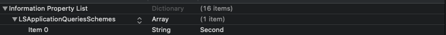

# 세번째 스터디

## 앱간 이동하기!!

----

다양한 어플들이 웹 또는 어플리케이션 안에서 어플리케이션으로 이동을 하는 기능을 만들고 있고 
다양한 방법으로 본인들의 어플리케이션으로 유도를 하고 있습니다.
이렇게 어플리케이션으로 이동할수있는 기능에 대해서 다루어보겠습니다.

앱간 이동을 위해서는 info.plist 를 활용해야 합니다.
Info.plis에 대한 레퍼런스는 [apple document link](https://developer.apple.com/library/archive/documentation/General/Reference/InfoPlistKeyReference/Introduction/Introduction.html#//apple_ref/doc/uid/TP40009248-SW1) 에서 확인을 할 수 있습니다.

위에서 말한 기능을 구현하기 위해서는 info.plist에서

LSApplicationQueriesSchemes 와 URL Type key를 이용하고 코드상으로 openURL을 사용해야합니다. 

[openURL](https://developer.apple.com/documentation/uikit/uiapplication/1622952-canopenurl?language=objc) 을 보게 되면 

> Parameters
> url
> A URL (Universal Resource Locator). At runtime, the system determines if an installed app is registered to handle the URL's scheme. More than one app can be registered to handle a scheme.
> The URL can have a common scheme such as http, https, tel, or facetime, or a custom scheme. For information about supported schemes, see [Apple URL Scheme Reference.](https://developer.apple.com/library/archive/featuredarticles/iPhoneURLScheme_Reference/Introduction/Introduction.html#//apple_ref/doc/uid/TP40007899)

와 같은 설명이 있으며 위의 메소드를 사용하게 되면 

1. mail 
2. phone 
3. Facetime 
4. message 
5. map
6. iTunes 
7. Youtube
8. Safari
9. 그리고 적혀있지 않는 LSApplicationQueriesSchemes에서 정의되어있는 설치된 application
10. appstore에 있는 application link

를 연결시킬 수 있습니다.

중요하게 다루려는 어플리케이션간 연결을 통한 이동을 해 보겠습니다.

> 첫 번째 앱의 info.plist를 설정하고
>
> 
>
> 두 번째 앱의 info.plist를 설정한 뒤
>
> 

- firstApplication

  

~~~swift
    @objc func toOtherApllication() {
            
        let application = UIApplication.shared
        let secondAppPath = "Second://"
        let appUrl = URL(string: secondAppPath)!
        let websiteUrl = URL(string: "http://naver.com")!
        if application.canOpenURL(appUrl){
            print("두 번째 앱으로 가기위한 설정이 되어있다면~")
            application.open(appUrl, options: [:], completionHandler: nil)
        } else {
            print("안되어있다면~", websiteUrl) // 로 연결된 사파리 링크로 넘어갑니다.
            application.open(websiteUrl)
        }
        
    }
~~~

와 같이 코딩을 한다면, 2번째 어플리케이션으로 넘어가게 됩니다.

또한 두 번째 앱에서 첫 번째 앱으로 넘어가게 하기 위해서

동일하게 설정을 하게 되면 아래와 같이 넘어갈수있게 됩니다!

또한 openURL을 통해 다양한 어플리케이션(지도 앱, 음악앱, 앱스토어...)으로 넘어갈수있으니 재미있게 활용을 할 수 있으면 좋겠습니다!